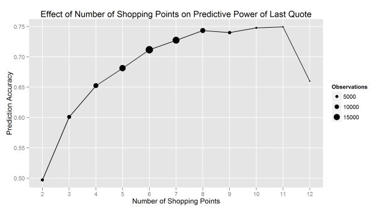
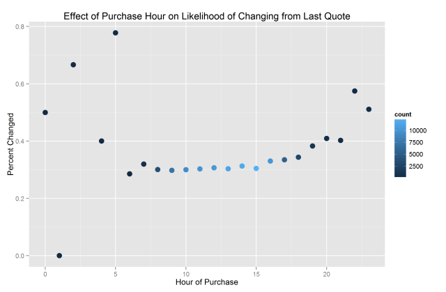
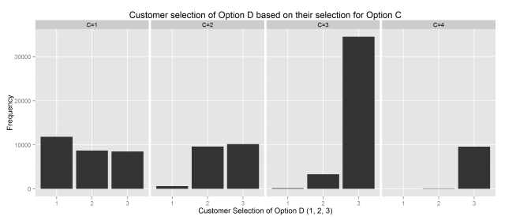
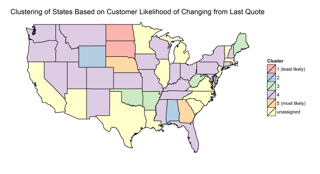

## Problem Statement

For my project, I entered the "[Allstate Purchase Prediction Challenge](http://www.kaggle.com/c/allstate-purchase-prediction-challenge)" on Kaggle. In this competition, the goal is to predict the exact car insurance options purchased by individual customers. The data available for training a model is the history of car insurance quotes that each customer reviewed before making a purchase, the options they actually purchased (the "purchase point"), and data about the customer and their car. The data available for testing was identical to the training set, except it was a different set of customers, the purchase point was excluded (since it was the value to be predicted), and an unknown number of quotes were also excluded.

For a prediction on a given customer to be counted as correct, one must successfully predict the value for all seven options, and each option has 2 to 4 possible values. Therefore, one could treat this as a classificiation problem with over 2,000 possible classes.

## Hypotheses

At the start of the competition, I came up with two hypotheses:

1. I hypothesized that smart feature engineering and feature selection would be more important than the usage of advanced machine learning techniques. This hypothesis was partially based on [readings](http://homes.cs.washington.edu/~pedrod/papers/cacm12.pdf) from the course, and partially based on necessity (my toolbox of machine learning techniques is somewhat limited!)

2. I hypothesized that there would be patterns in the data that I could use to my advantage, which would not necessarily even require machine learning. Here are some examples of patterns that I hypothesized:
	* Customers buying the last set of options they were quoted
	* Customers reviewing a bunch of different options, and simply choosing the set of options that they looked at the most number of times
	* Customers reviewing a bunch of different options, and simply choosing the set of options that was the cheapest
	* Individual options that are highly correlated (e.g., if A=1, then perhaps B is almost always 0)
	* Sets of options that are "illegal" (e.g., if C=1, then perhaps D cannot be 2)
	* Sets of options that are extremely common for a given customer characteristic (e.g., families with young kids always choose E=0 and F=2)

## Data Exploration and Visualization

Here are some of my key findings from the exploratory process, and what I concluded from those findings.

1. **Missing values:**
	* risk_factor was NA is 36.1% of the training set and 38.0% of the test set. As a predictor that I considered potentially useful, I decided to impute the risk_factor for those customers using a linear regression model based on other customer characteristics.
	* C_previous and duration_previous were NA for 2.8% of the training set and 4.9% of the test set. I decided that those NA values were probably indicative of new customers, and thus I imputed values of 0 for duration_previous and "none" (a categorical variable) for C_previous.
	* location was NA for 0.3% of the test set. I decided to impute the location for each customer by copying the location from another customer in the same state.

2. **Unique plans:**
	* Out of the 2,304 possible combinations of the 7 options, the training set included 1,809 unique plans and the test set included 1,596 unique plans. The union between those two sets included 1,878 unique plans, indicating that the test set contained 69 plans that were in the test set but never appeared in the training set.
	* Because more than 80% of the possible combinations did actually appear in the data, and because the number of plan combinations is so large, I concluded that it was better to predict the 7 individual options for each customer and combine them, rather than try to predict the entire plan (all 7 options at once) using a single model.

3. **Number of shopping points:**
	* As seen in the plot below, the training set contained a roughly normal distribution of "shopping points" (the number of quotes a customer reviewed), whereas the test set contained a a very different distribution. 
	* I concluded that the number of shopping points was probably deliberately truncated in the test set in order to limit the information available to competitors and make the problem more challenging. (Kaggle later [confirmed](http://www.kaggle.com/c/allstate-purchase-prediction-challenge/forums/t/7240/is-the-test-data-truncation-a-trim-or-thinning-out) that the test set was truncated, but [declined](http://www.kaggle.com/c/allstate-purchase-prediction-challenge/forums/t/7119/recreating-a-truncated-test) to provide details on the truncation algorithm.) I also concluded that it might be useful to similarly truncate the training set (for cross-validation) to provide more accurate estimates of test error during the modeling process.

4. **Predictive power of final quote before purchase:**
	* As seen in the plot below, the final quote a customer requests before the "purchase point" is hugely predictive (in the training set) of which options they will actually purchase. The final quote correctly predicted the purchased options 50% to 75% of the time, with that percentage steadily increasing as customers review more quotes. (Note that the right side of the plot is unstable due to the small number of observations with 10 or more shopping points.) 
	* I concluded that using the final quote in the test set as a predictor of the purchase would be an excellent baseline strategy, and indeed this method was used as the "benchmark" on the Kaggle leaderboard (producing a score of 0.53793 on the public leaderboard).
	* I also concluded that this is precisely why the number of shopping points was truncated in the test set; otherwise, the baseline strategy would likely have worked about 75% of the time on the test set.

5. **Effect of purchase hour on the predictive power of the final quote:**
	* I hypothesized that the time of day might affect the likelihood that a given customer would change their options between the final quote and the purchase point. As seen in the plot below, customers making a purchase between 9am and 4pm tended to change from their final quote about 30% of the time, whereas customers purchasing in the evening (or especially overnight) tended to change their options 35% of the time (or more). 
	* I concluded that the time of day would be a useful feature to include in my models. I also concluded that binning the time into a few distinct categories might create an even more useful feature, since the variability during the overnight hours (as seen in the plot) would cause the model to overfit the training data for those individual hours, and thus an "overnight" category (averaging those values) would be more stable.

6. **Dependencies between options:**
	* I created dozens of plots to explore the relationships between the 7 different options (for the purchase point only). One example is below, in which I'm plotting the 3 options for D faceted against the 4 options for C. As you can see, there are clear patterns in the data. D=1 is only likely if C=1; D=3 is very likely if C=3, and is basically guaranteed if C=4. 
	* I compiled [a set of "rules"](allstate-option-dependencies.md) similar to this across all of the options, and concluded that I might be able to use those rules to "fix" any predicted combinations in the test set which seemed unlikely.

## Feature Transformation and Engineering

The [dataset provided by Kaggle](http://www.kaggle.com/c/allstate-purchase-prediction-challenge/data) included 25 features. I used some of those features as-is, and I engineered additional features using transformations or combinations of features. The competition rules did not allow the use of supplementary datasets, and so no other data was used.

1. **Features used as-is:** I used the following features as-is, and either treated them as continuous variables or categorical variables. For the final model, the A through G options were treated as the response variables with all other variables used as predictors, though I also built an intermediate model (described further in the "Model Building" section) in which A through G were used as predictors instead.
	* Continuous variables:
		* group_size: number of people covered by the policy
		* car_age: age of customer's car
		* risk_factor: 1 through 4 assessment of customer risk
		* age_oldest: age of oldest person covered by the policy
		* age_youngest: age of youngest person covered by the policy
		* duration_previous: years covered by previous issuer
		* cost: cost of quoted options
	* Categorical variables:
		* state: customer location
		* location: ID of customer location (more specific than state)
		* homeowner: yes or no
		* car_value: value of customer's car when new, expressed only as letters 'a' through 'i'
		* married_couple: yes or no
		* C_previous: what customer previous had for option C
		* A/B/C/D/E/F/G: coverage options

2. **"Simplified" features:** I created "simpler" versions of certain features, under the theory that simpler features might be less noisy and could possibly prevent my models from overfitting the training set.
	* Instead of using "time" as a feature, I created an "hour" categorical feature by truncating the minutes from the exact time. I also created a "timeofday" categorical feature using the data from exploration #5 above: day (6am-3pm), evening (4pm-6pm), and night (7pm-6am).
	* Instead of using "day" as a feature, I created a "weekend" categorical feature (yes=weekend, no=weekday).
	* There were a very small number of cars with a "car_age" of 30 to 75 years. Since I was using car_age as a continuous feature, I decided to convert all car ages over 30 to be exactly 30, under the theory that the purchase behavior of those users might be similar.
	* During the model building process (discussed in detail below), I noticed that the customer's state appeared to affect their likelihood of changing options between the last quote and the purchase point. States in which that likelihood was very low (North Dakota, South Dakota, Alabama, and Wyoming) also happened to be the states that I think of as the least technologically advanced. If outside data was allowed, I would have tried adding a new feature to reflect the technological level of each state. But since outside data is not allowed, I created a "stategroup" categorical feature by clustering states into 5 groups using their "likelihood of change" coefficient from one of my models. The group assignments are shown below; note that 15 states have not been assigned a group since they are not present in the dataset. 

3. **"Conceptual" features:** I created a few features to represent "concepts" by combining different features, under the theory that the concepts might have better predictive power than the individual features (in a way that might not be captured by an interaction term).
	* I created a "family" categorical feature for any customer that was listed as married, had a group size larger than 2, and the age of the youngest covered individual (presumably their child) was less than 25.
	* I created an "agediff" continuous feature that was simply the age difference between the youngest and oldest covered individuals.
	* I created an "individual" categorical feature for any customer whose group size was 1 and the "agediff" was 0.

4. **Features to represent past quotes:** When anticipating the model building process, I knew from item #4 of data exploration (above) that the final quote before purchase would have the best predictive power of the actual purchase. Given that I only wanted to make a single prediction per customer, my plan was to only use that final quote before purchase (for each customer) as the input to the model. That seemed to waste a lot of available (and potentially useful) data, but I had a difficult time conceptualizing how to effectively integrate the not-final-quote data into the model. I came up with two solutions:
	* I used "shopping_pt" as a continuous feature, since it represented the number of quotes a customer requested before purchasing. My theory (based on data exploration #4) was that a higher shopping_pt indicated a greater likelihood that the customer would simply choose the last quote, making shopping_pt a useful predictor.
	* I created a new continuous feature called "stability", which was a number between 0 and 1 that represented how much a given customer changed their plan options during the quoting process. I created the formula stability=(numquotes - uniqueplansviewed + 1)/numquotes. For example, a customer who requested 8 quotes but only looked at 3 different plan combinations would have a stability of (8-3+1)/8 = 0.75, whereas if they had looked at 8 different plan combinations, their stability would be (8-8+1)/8 = 0.125. My theory was that a low stability would indicate a high likelihood of changing options between a customer's final quote and actual purchase.

5. **Feature to represent plan frequency:**
	* I created a "planfreq" continous feature that was simply the frequency with which a given plan occurred across all customers. My theory was that a plan with a low frequency might indicate a greater likelihood of switching options, since perhaps that combination of options is unpopular for a reason.

## Challenges with the Data

1. The biggest challenge with the dataset was that there were over 2,000 possible plan combinations, and your prediction is only scored as correct if all 7 options are correct. Additionally, the Kaggle system does not provide any feedback on "how wrong" your predictions are, making it impossible to differentiate between a prediction in which 6/7 options are correct and a prediction in which 1/7 options are correct.

2. Another huge challenge (closely related to challenge #1) is that there is a huge "risk" when predicting any plan other than the last quote. As discussed in data exploration #4, you can obtain roughly 50% accuracy on the test set simply by using the last quote as your prediction. Thus, if you predict anything other than that last quote for a given customer, you have a 50% chance of "breaking" an already correct prediction. The only way to mitigate that risk is by developing a predictive model that is more than 50% accurate. And since I had decided to predict each of the 7 options individually (based on data exploration #2), those 7 predictive models would each have to be at least 90% accurate in order for the combined prediction to be at least 50% accurate (since 0.90^7 roughly equals 0.50). 90% accuracy for 7 different models is quite a high bar!

3. As discussed in feature engineering #4, it was challenging to determine how to use the not-final-quote data.

4. One of my hypotheses was that customers who do change from their final quote might simply be changing to a set of options that they looked at previously. If this was often the case, it could make prediction significantly easier, and eliminate the need to predict each option individually. Unfortunately, when I examined the quote history of 15 random customers (in the training set) that did change from their final quote, I found that every single one of them purchased a combination of options that they never looked at during the quoting process.

5. Another challenge with the dataset is that the car insurance options are not identified in any meaningful way, preventing you from making educated guesses about which options are correlated and which variables might influence each option.

6. As discussed in data exploration #3, the test set was substantially truncated in terms of number of quotes per customer, making it more challenging to build models that work well on both the training set and the test set.

## Model Building

Below is a description of the model building process I went through. Because I'm most fluent in R, I built all of the models (and did all of the visualization and feature engineering) in R.

1. As discussed in data exploration #4, my baseline strategy was to predict the purchase options for each customer simply by using their last quote. That produced a score on the public leaderboard of 0.53793, which represents your accuracy on 30% of the test set. (Since around half of the competitors [obtained](http://www.kaggle.com/c/allstate-purchase-prediction-challenge/leaderboard) that exact score, one can infer that this strategy was widely used.) All of my follow-up models simply revised the baseline predictions, rather than predicting every customer "from scratch".

2. As discussed in data exploration #6, I noticed correlations between certain options. For example, D is nearly always 3 if C equals 4 for a given customer. Using these and other "rules" that I developed during the exploratory process, I revised the baseline predictions by simply converting any pairs of options that seemed unlikely. In other words, if one of my baseline predictions had C equals 4 and D not equal to 3, I changed D to 3. I submitted a variety of these rule-based predictions, and every time my score on the public leaderboard decreased. I realized the flaw in this approach: For any customer where the baseline was predicting incorrectly, it's impossible to know how many of their options are incorrect. Thus the rule-based approach may fix a single incorrect option, but it also "breaks" baseline predictions that were already correct at a much higher rate.

3. My key insight from the previous model building step was that it was critical to not break existing baseline predictions that were already correct, and only attempt to "fix" baseline predictions that were already incorrect (since there would be no risk of making those predictions worse). Thus, I decided to use a multi-stage approach, in which I first predicted which customers were going to change from their final quote, and then would predict new options only for that smaller set of customers.

4. For predicting who would change, I began with logistic regression on the training set and created a 5-fold cross-validation framework to predict test set accuracy. I also tried random forests, but stuck with logistic regression for the time being because it ran much quicker and thus allowed me to iterate much more quickly through different models.

5. My prediction accuracy (of which customers would change) barely increased over the null error rate, regardless of which features I included in the model. Therefore, I decided to instead optimize my model for precision and set a high threshold for predicting change. In other words, I would only be predicting change for a very small number of customers, but I would be highly confident that those customers would change. I created a new 5-fold cross-validation framework to calculate precision of my "change" predictions, and managed to get 91% precision. I then tested this method by predicting change for the test set, changing my baseline predictions for that small number of customers to "9999999" (definitely incorrect), and then see how my public leaderboard score was affected. It appeared that this method was about 75% accurate on the test set, which validated this approach.

6. I repeated step #5 of the model building process using random forests instead of logistic regression, to see if that would improve my precision. I again created a 5-fold cross-validation framework and set a high threshold for predicting change by examining the fraction of out-of-bag "votes" that predicted change. Despite some effort at tuning the model, I was not able to improve upon the results from logistic regression.

7. I moved on to the second stage of model building, namely predicting the new set of options for those customers who I'm predicting will change from their last quote. As discussed in data exploration #2, I had decided to predict each option individually, rather than try to predict the set of options as a whole. Since most of the 7 options have more than 2 classes, I explored different R packages for multinomial classification. I first considered the `mlogit` and `mnlogit` packages, but found the documentation confusing. I tried using the `glmnet` package for regularized multinomial classification, but it took an exceptionally long time to run. I ended up using both random forests (from the `randomForest` package) and the multinom function (from the `nnet` package), both of which ran relatively quickly.

8. During the multinomial classification process, I tried three different approaches. To explain the approaches, we can use the "A" option as an example:
	* For approach #1, I tried to predict A (for each customer) by giving the model every feature other than A in that customer's final quote. That approach only produced 60%-80% accuracy on the training set (across each of the 7 options), making this approach too inaccurate to be useful.
	* For approach #2, I gave the model the same features as approach #1 but also gave it "current A" as a feature, and asked it to predict "final A". The training set accuracy for approach #2 rose significantly, but only because the model simply predicted "final A" to be equal to "current A" 99.9% of the time, making it a useless model.
	* For approach #3, I revised approach #2 by only training the model on the subset of data for which change was predicted. Unfortunately, this approach performed no better than approach #1.

9. Since my attempts at multinomial classification were unsuccessful at improving upon the baseline strategy, I decided to supplement the machine learning approach with a "human learning" approach:
	* First, I set a very high threshold for my logistic regression model for predicting which customers would change from their final quote, resulting in a prediction that only 9 customers would change.
	* Second, I manually adjusted the options for those 9 customers using the loose [set of "rules"](allstate-option-dependencies.md) I had created in data exploration #6. Essentially, I was looking for any unlikely option combinations in their final quote and changing them to a more likely combination.
	* Third, I tweaked those manual option predictions by comparing them against the predictions generated by my random forest model for multinomial classification.
	* Although this was a time-intensive process and completely non-scalable, I decided that if it worked, I could potentially figure out how to scale it.
	* When I submitted my new predictions to Kaggle, my public leaderboard score was identical to the score for the baseline approach. That indicated that either none of those 9 customers were part of the public leaderboard, or that those few customers who were part of the public leaderboard were not corrected by my manual predictions.

## Ideas for improving the models

These are rough notes for myself about things I haven't yet tried. If I had unlimited time, I'd try all of them! For the final paper, I'll move the things I actually did to the section above.

1. Experiment with interactions that make sense (to improve change prediction)

2. Feature selection using the `relaimpo` and `bestglm` packages

3. Use the quote before the last quote as a set of additional features (A through G, day, time, cost)

4. Further tuning of randomForest for predicting change (variable selection, ntree, mtry)

5. Predict change using a bunch of models and then average the results

6. When predicting change, instead of using a high cutoff and then only predicting new values for those customers, instead pass the "change probability" as a feature to the next model.

7. Come up with a better way to take advantage of interactions and dependencies between options.

8. Come up with more ways of incorporating the not-final-quote data.

9. Truncate the training set to match the test set distribution.

10. Clustering, then predict separately for clusters?

11. PCA?

## Results

This will discuss my results, as well as the leaderboard results and commentary about the leaderboard.

## Conclusion

Concluding thoughts on what worked, what didn't, and the business applications.
